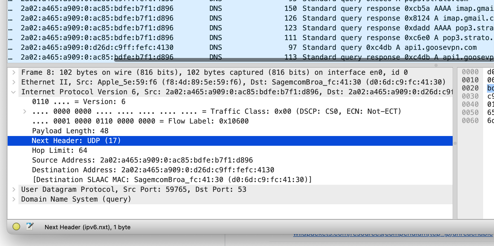

# Using Wireshark

Wireshark can be a very handy tool to see some actual networking in action. And if all of your logic fails to see why a given connection is not possible this can function as a sort of last resort. It can also be usefull to help with writing a binary parser for some industrial tools if thats your thing. 

### A request

Let's see what happens when we fire off a request, for example with 

```shell
nslookup reddit.com
```

```text
Server:		xx.xx.xx.xx
Address:	xx.xx.xx.xx#53 <-- port 53, standard for DNS

Non-authoritative answer:
Name:	reddit.com
Address: 151.101.193.140
Name:	reddit.com
Address: 151.101.65.140
Name:	reddit.com
Address: 151.101.1.140
Name:	reddit.com
Address: 151.101.129.140
```
this means that reddit.com actually listens on 4 different IP adresses. 


```shell
curl nu.nl
```

### Filtering

Some handy filtering stuff

type of filters are for example
- == which means equals
- != unequal
- or , and which is classic logic 
- tcp.port in {80, 443, 8000..8005} noice! even with a range from 8000 to 8005.  

IP adress filtering, doh
- ip.addr==x.x.x.x (both source and destination)
- ip.src (source of the request)
- ip.dest (destination of the request
- ipv6.xxx for ipv6 stuff 
- cidr is also possible! ip.addr==10.6.0.0/16 Wow :D

I want to see DNS traffic

- dns (that's it, just put dns in there. 

I want to see only ipv6 things

- ipv6 (easy huh)


But finally here is the real filtering legend, in the image below you can see (very small) that when going into the packets you can look around at what is in it, but in the bottom left corner within brackets you can see which filter you need to use to filter on that specific aspect of the packet. So no memorization for you, just look at what you're interested in and use that! If the field cannot be filtered for the value wont show a value within brackets. 



For people who really dislike typing you can also drag and drop! Just click and hold a source address in the overall screen, drag it to the filter and boom, filtering on that specific source ip address. 

If you want to see a list of just the addresses that are being used, go to the top toolbar, go to `statistics` and click `Endpoints` then you can see all the addresses that you are actually communicating with. 

You can also create a `filter button` if you feel like the filter you are using is one that you will use often, go to the plus in the right top corner and create a standard filter. 


